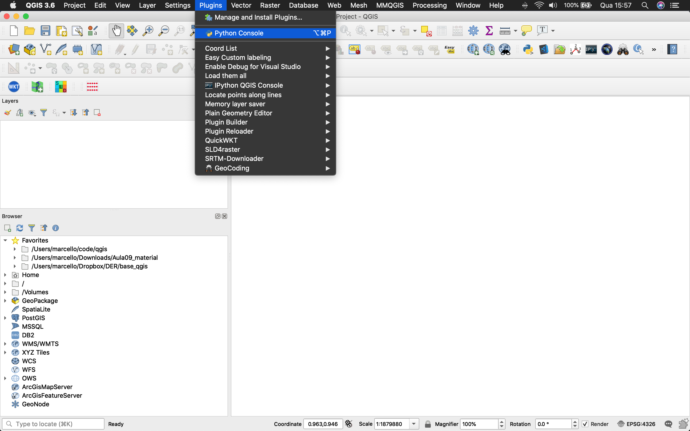

# 1. Introdução ao PyQGIS

O PyQGIS é um pacote python, que permite que você acesse e manipule o QGIS de diferentes formas, dentre as quais, é possível:

* invocar comandos no console;
* executar automaticamente um código python, quando o QGIS for inicializado;
* criar ações customizadas;
* criar novos algoritmos de processamento;
* criar plugins, e
* criar novas aplicações independentes (stand-alone).

### 1.1 Criando o seu primeiro programa:

Para acessar o console python, o usuário deve entrar no menu `plugins` e clicar em `python console`:



Em seguida, abra o editor, clicando no botão da figura abaixo:


Digite no editor o código:

```python
print('Olá Mundo')
```

Execute  o código, clicando no botão `Run Script`. O Resultado será visto na janela ao lado.