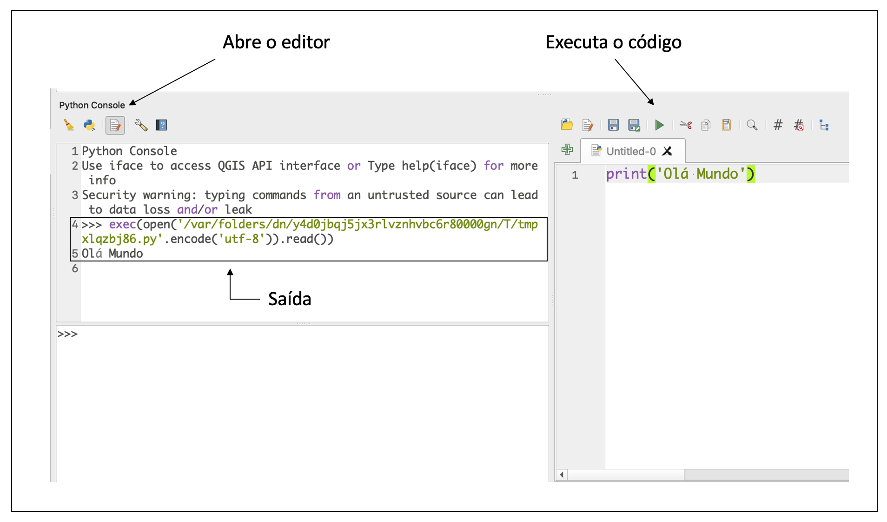

# 1. Introdução ao PyQGIS

O PyQGIS é um pacote python, que permite que você acesse e manipule o QGIS de diferentes formas, dentre as quais, é possível:

* invocar comandos no console;
* executar automaticamente um código python, quando o QGIS for inicializado;
* criar ações customizadas;
* criar novos algoritmos de processamento;
* criar plugins, e
* criar novas aplicações independentes (stand-alone).

## 1.1 Criando o seu primeiro programa:

Para acessar o console python, o usuário deve entrar no menu `plugins` e clicar em `python console`:


Em seguida, abra o editor, clicando no botão da figura abaixo:



Digite no editor o código:

```python
print('Olá Mundo')
```

Execute  o código, clicando no botão `Run Script`. O Resultado será visto na janela ao lado.

## 1.2 Trabalhando com Projetos do QGIS

A classe responsável pela manipulação de projetos no QGIS se chama `QgsProject`. A documentação oficial da [API PyQGIS](https://www.qgis.org/pyqgis/3.0/core/Project/QgsProject.html#module-QgsProject) descreve com detalhes todas as possibilidades de utilização da mesma.


Vamos criar uma variável chamada `project` e associá-la ao projeto atual:

```python

project = QgsProject.instance()

print(project)
```


Observe que neste caso, como o projeto não foi salvo ainda, temos como resposta uma instância da classe **QgsProject** sem nome: `QgsProject: '' (singleton instance)`


### 1.2.1 Abrindo projetos do QGIS:

Para abrir um projeto já existente no QGIS você deve utilizar o método `read()`, que recebe como parâmetro, o caminho do projeto no seu sistema operacional. Se você utiliza Windows, lembre-se de colocar um **r** no início do seu path, exemplo:

```
path = r'C:\Users\Marcello\Documents\exemplo.qgz'
```

isto indicará que a ```\``` não será interpretada como um *scape*


```python
project = QgsProject.instance()

# local onde está o seu projeto
path = r'C:\Users\Marcello\Documents\exemplo.qgz'

```

### 1.2.2 Salvando projetos do QGIS

Para salvar um projeto, utilize o método `write()` passando como argumento, o local onde o arquivo será salvo. Caso o arquivo exista, o projeto será sobrescrito.


```python
project = QgsProject.instance()

# local onde está o seu projeto
path = r'C:\Users\Marcello\Documents\exemplo.qgz'

# realize algumas modificações no projeto, e salve a seguir:

project.write(path)

```

### 1.2.3 Alterando o Background Color do Projeto

```python
project = QgsProject.instance()

color = QColor(0,191,255)

project.setBackgroundColor(color)
```


### 1.2.4 Obtendo a Quantidade de Camadas do Projeto

```python
project.count()
```

### 1.2.5 Alterando o CRS do Projeto

```python
project.crs()

sirgas2000 = QgsCoordinateReferenceSystem('EPSG:4674')

project.setCrs(sirgas2000)
```
