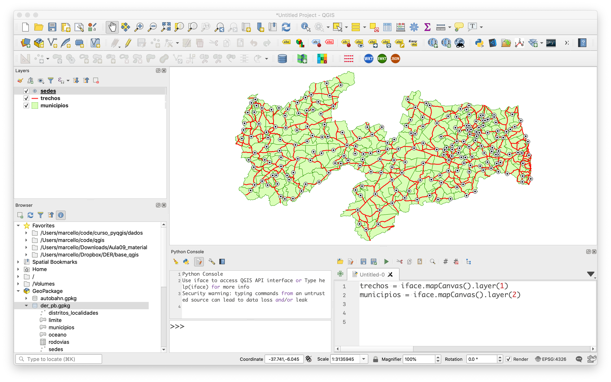

# 2. Acessando Camadas

Para manipular a interface do QGIS, iremos utilizar uma variável chamada`iface`. Ela  é criada toda vez que o QGIS é aberto. `iface` é uma instância da classe `QgisInterface` e pode ser utilizada pde diversas formas. tanto para modificar a interface ( alterar menus, toolbars, etc), ou pode ser utilizada para acessar o `map canvas`, que é a área onde os layers são exibidos (área do mapa).

Podemos criar uma variável que referencie o Canvas da seguinte forma:

```python
mc = iface.mapCanvas()
```

Através da manipulação da variável `mc` é possível modificar o nível de zoom, alterar a escala, trocar a cor do background, dentre outras possibilidades, tais como:

```python
# obter o layer ativo:
current_layer = mc.currentLayer()

# obter a lista dos layers que estão visíveis:
checked_layers = mc.layers()
```

Trocando o background do canvas:
```
iface.mapCanvas().setCanvasColor(QColor(0, 153, 255))

iface.mapCanvas().refresh()
```

## Obtendo um layer através do seu nome:

Este procedimento é feito da seguinte forma:

```python
# obtendo uma camada chamada lotes:
lotes = QgsProject.instance().mapLayersByName('lotes')[0]
```

💡 Explicando: acessamos a instância do projeto atual `QgsProject.instance()` e através do método `mapLayersByName()` passamos como parâmetro o nome da camada em questão. o resultado deste processo é uma lista com um único elemento e por essa razão, utilizamos o índice `[0]` para pegar o primeiro elemento desta lista.

## Obtendo um layer através do seu índice:

Também podemos acessar uma camada através de seu índice, na ordem em que elas são listadas no paiel de layers. Exemplo: para acessar a camada da figura abaixo, poderíamos fazer da seguinte forma:



```python
sedes = iface.mapCanvas().layer(0)
trechos = iface.mapCanvas().layer(1)
municipios = iface.mapCanvas().layer(2)
```

## 2.1 Acessando Informações da Camada:

Quantidade de feições da camada:

```python
lotes.featureCount()
```

Nomes dos campos:

```python
for field in lotes.fields():
    print(field.name(), field.typeName())
```

Atributos de cada feição:

```python
for feature in lotes.getFeatures():
    print(feature.attributes())
```

Acessando a geometria de cada feição:

```python
for feature in lotes.getFeatures():
    print (feature.geometry())
```

Sistema de Referência de Coordenadas (CRS):

```python
print(lotes.crs().description())
```
Extensão da camada:

```python
print(lotes.extent())
```
Como resultado, o QGIS retorna uma instância da classe `QgsRectangle`. porém, se quisermos obter a extensão de forma numérica, podemos fazer:

```python
ext = lotes.extent()
min_x=ext.xMinimum()
max_x=ext.xMaximum()
min_y=ext.yMinimum()
max_y=ext.yMaximum()
print(min_x,min_y,max_x,max_y) 
```