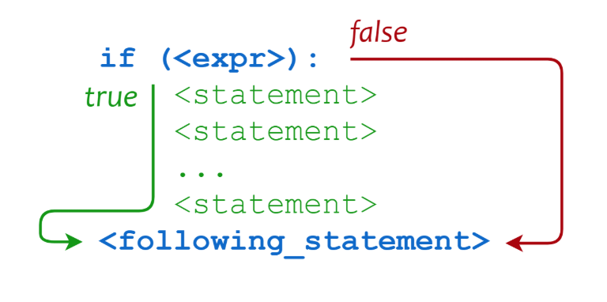

# 2.  Desvios Condicionais

Para criar um desvio condicional utilizamos o comando `if`. É avaliada a condição para que uma sequência de comandos seja executada.



Figura extraída do site [Real Python](https://realpython.com/python-conditional-statements/)

### Exemplos:

```python
idade = 5

if idade < 18:
    print("menor de idade")
else:
    print("maior de idade")
```
Interagindo com o usuário através da função `input`:
```python
idade = int(input("Digite sua idade"))

if idade < 18:
    print("menor de idade")
else:
    print("maior de idade")
```

💣  Cuidado! a função `input` sempre vai retornar uma string, esteja atento a isso.

### Operadores de Comparação:

```
==	Igual
!=	Diferente
>	Maior que
<	Menor que
>=	Maior ou igual que
<=	Menor ou igual que
```

### `elif` (else if, se não se):

Em alguma situações precisamos encadear várias condições de teste em um programa, para isso, podemos juntar o comando `else` com o `if`. No python temos um comando que faz justamente isso para nós, o `elif` (else + if). com ele podemos passar mais uma condição e realizar vários testes em sequência. O `elif` segue a mesma ideia do `if` e do `else`. Caso a condição passada para ele seja verdadeira, é executado seu bloco de código baseado no **alinhamento**.

```python
idade = 30

if idade >= 65:
    print("passagem gratuita")
elif idade >= 18:
    print("passagem inteira")
else:
    print("meia passagem")
```

```python
x = 44

if x > 100:
    print("x maior que 100")
elif x > 50:
    print("x maior que 50 e menor ou igual que 100")
elif x > 0:
    print("x maior que 0 e menor ou igual que 50")
else:
    print("x menor ou igual que 0")
```

### Operadores Ternários:

Um operador ternário é definido em Python da seguinte forma:

```python
<expr1> if <conditional_expr> else <expr2>
```

Logo, a expressão abaixo:

```python
if a > b:
  m = a
else:
  m = b
```

Pode ser representada da seguinte forma:

```python
m = a if a > b else b
```

### O Statement `pass`:

O `pass`significa que após a avaliação da condição, não será feito nada (passe...), exemplo:

```python
if True:
    pass

print('foo')
```
O `pass` é mais utilizando quando ainda não estamos certo do que queremos fazer no código, como na definição de uma classe ou de uma função, por exemplo. Mas isso é papo para outra hora 😛 

