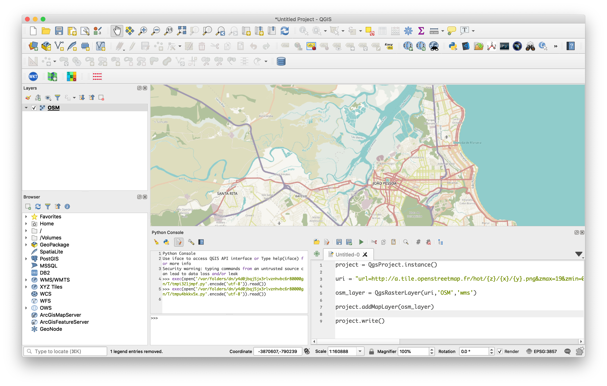

# 3. Adicionando Camadas

## 3.1 Adicionando Camadas Vetoriais

Para adicionar uma nova camada no QGIS, é necessário saber o local exato do arquivo:

```python
# exemplo 1: shapefile no windows:
path = 'c:/dados/shp/municipios.shp'

# exemplo 2: layer em um geopackage no unix/linux:
path = '/Users/code/qgis/pbdata/pb.gpkg|layername=municipios'
```

O carregamento do arquivo é feito com o método `addVectorLayer`, da variável `iface`:

```python
municipios = iface.addVectorLayer(path, 'municipios', 'ogr')
```

💡 Quando o QGIS é aberto, é criada na sua sessão uma variável chamada `iface` que é uma instância da classe `QgisInterface`. Esta classe permite que o usuário possa interagir com o ambiente do QGIS em execução.

O método `addVectorLayer` recebe três parâmetros:

* O caminho até o arquivo, neste caso a variável path;
* O nome da camada que será exibido, após o seu carregamento, e
* O **provider**, que é uma espécie de driver utilizado para carregar determinado tipo de dado. mais informações sobre o provider podem ser encontradas no link abaixo: 

## 3.2 Adicionando Camadas Raster

Assim como para as camadas vetoriais, também existe um método responsável por carregar os dados no formato raster chamado `addRasterLayer`:

```python
path = 'Users/code/qgis/pbdata/SB-25-Y-A.tif'

srtm = iface.addRasterLayer(path, 'srtm', 'gdal')
```

## 3.3 Adicionando Camadas do PostGIS

Para acessar uma camada do PostGIS, devemos utilizar a classe `QgsDataSourceUri`, ela possui os componentes de um URI de um SGBDE, incluindo host, banco de dados, nome de usuário, senha, esquema, e a cláusula `where`, quando necessária.

```python
uri = QgsDataSourceUri()
uri.setConnection('localhost', '5432', 'nome_banco', 'usuario', 'senha')
uri.setDataSource ('public', 'tabela', 'geom')

vlayer = QgsVectorLayer(uri.uri(False), 'tabela', 'postgres')

QgsProject.instance().addMapLayer(vlayer)
```

Existem vários outros tipos de dados que podem ser carregados de forma análoga ao que foi mostrado: csv, wms, wfs, geodatabase (ESRI), dentre outros. Pesquise sobre como carregar estes outros formatos.

## 3.4 Adicionando Camadas CSV:

```python
folder = '/Users/marcello/code/curso_pyqgis/dados/'
uri = f'{folder}pocos_pb.csv?delimiter={";"}&xField={"x"}&yField={"y"}'
vlayer = QgsVectorLayer(uri, "pocos", "delimitedtext")
```

## 3.5 Adicionando XYZ Tiles e Camadas WMS

```python
folder = '/Users/marcello/code/curso_pyqgis/dados/'

uri = f"file:{folder}pocos_pb.csv?type=csv&detectTypes=yes&xField={'x'}&yField={'y'}&crs=EPSG:{4326}"

csv = QgsVectorLayer(uri, 'pocos', 'delimitedtext')

QgsProject.instance().addMapLayer(csv)
```

Ou podemos adicionar através da instância do projeto:

```python
project = QgsProject.instance()

uri = "url=http://a.tile.openstreetmap.fr/hot/{z}/{x}/{y}.png&zmax=19&zmin=0&type=xyz" 

osm_layer = QgsRasterLayer(uri,'OSM','wms')

project.addMapLayer(osm_layer)

project.write()
```


Para adicionar uma camada do **Google Maps**, o procedimento é o seguinte:

```python
import requests
service_url = "https://mt1.google.com/vt?"
service_params= 'lyrs=y&x={x}&y={y}&z={z}'
service_uri = 'tilePixelRatio=1&type=xyz&url='
service_uri +=f'{service_url}{requests.utils.quote(service_params)}'
service_uri +='&zmax=18&zmin=0'

gmaps_satellite = iface.addRasterLayer(service_uri, 'gmaps', 'wms')
```

Experimente trocar a letra **y** logo após ao parâmetro `lyrs=` para as seguintes letras:

* lyrs=**s**&x={x}&y={y}&z={z}
* lyrs=**p**&x={x}&y={y}&z={z}
* lyrs=**m**&x={x}&y={y}&z={z}

E veja o que acontece com o mapa.