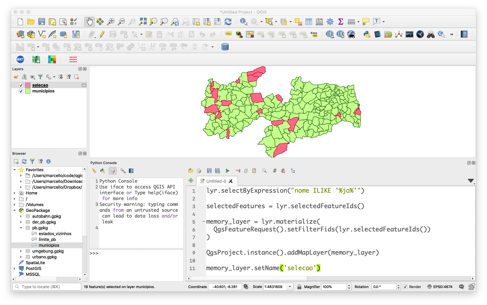

# 5. Selecionando Feições Através de Expressões SQL

## 5.1 Criando uma Camada Filtrada:

Em alguns momentos temos a necessidade de exibir apenas uma certa quantidade de dados da nossa camada a partir de um filtro. Digamos que para a nossa análise, apenas o município de Campina Grande é do nosso interesse:


```python
lyr = QgsProject.instance().mapLayersByName('municipios')[0]

filter = "nome = 'Campina Grande'"

lyr.setSubsetString(filter)

iface.mapCanvas().setExtent(lyr.extent())

iface.mapCanvas().refresh()
```
Como resultado, temos a nossa camada filtrada:


Para limpar a seleção, basta aplicar o filtro sem a expressão SQL:

```python
lyr.setSubsetString('')
```

## 5.2 Selecionando Feições (Select by Expression)

Para selecionar as feições da camada, utilizamos o método `selectByExpression()`, passando como argumento uma expressão SQL:

```python
lyr.selectByExpression("nome ILIKE '%jo%'")

box = lyr.boundingBoxOfSelected()

iface.mapCanvas().setExtent(box)

iface.mapCanvas().refresh()
```

 
## 5.3 Identificando os IDs das Feições Selecionadas:

Uma vez feita a seleção, podemos querer alterar os seus atributos, por exemplo. Para isso é necessário identificar os IDs das feições:

```python
selectedFeatures = lyr.selectedFeatureIds()

print(selectedFeatures)

# >>> [70, 210, 211, 209, 74, ...]
```
 
 ## 5.4 Criando uma Camada em Memória das Feições Selecionadas:
 
```python    
lyr.selectByExpression("nome ILIKE '%jo%'")

selectedFeatures = lyr.selectedFeatureIds()

memory_layer = lyr.materialize(
  QgsFeatureRequest().setFilterFids(lyr.selectedFeatureIds())
)

QgsProject.instance().addMapLayer(memory_layer)

memory_layer.setName('selecao')
```


