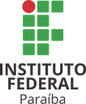

# Programação Aplicada ao SIG
Uma abordagem utilizando o QGIS e a linguagem Python

### FUNDAMENTOS DA LINGUAGEM PYTHON

#### [1. Introdução à Linguagem][a]
#### [2. Desvios Condicionais][b]
#### [3. Strings][c]
#### [4. Listas e Tuplas][d]
#### [5. Dicionários][e]
#### [6. Funções][f]
#### [7. Classes][g]

### GeoPandas

#### [1. Introdução ao GeoPandas][gp1]

### PYQGIS

#### [1. Introdução ao PyQGIS][1]
#### [2. Acessando Camadas][2]
#### [3. Adicionando Camadas][3]
#### [4. Acessando os Atributos de uma Camada][4]
#### [5. Selecionando Feições Através de Expressões SQL][5]
#### [6. Criando Camadas Vetoriais][6]
#### [7. Entrada de Dados][7]

### Links e vídeos:

#### Sobre Python:
Canais no YouTube:
1. [Eduardo Mendes](https://www.youtube.com/channel/UCAaKeg-BocRqphErdtIUFFw)
2. [Henrique Bastos](https://www.youtube.com/user/henriquebastosnet)
3. [Python Pro](https://www.youtube.com/user/renzonuccitelli)
4. [Socratica](https://www.youtube.com/user/SocraticaStudios)

Livros:
1. [Pense em Python](https://penseallen.github.io/PensePython2e/)
2. [Automate the Boring Stuff with Python](http://automatetheboringstuff.com/)

Cursos:
1. [Python Pro](https://www.python.pro.br/)
2. [Python para Zumbis](https://www.pycursos.com/python-para-zumbis/)
3. [Welcome to the Django](https://henriquebastos.net/produtos/welcome-to-the-django/)

#### Sobre PyQGIS:

Canais no YouTube:

1. [Canal Geocast Brasi](https://www.youtube.com/channel/UCLAeX4dyujMoy4xqHvxSDpQ/featured)
2. [Canal Open Source Options](https://www.youtube.com/channel/UCOSeGDrlScCNgBcN5C8nTEw)
3. [Curso de Programación QGIS 3 con Python](https://www.youtube.com/user/UPM/search?query=pyqgis)

Udemy:

1. [Automating QGIS 3.xx with Python](https://www.udemy.com/course/automating-qgis-3xx-with-python/)

Leituras:

1. [QGIS Python API](https://qgis.org/pyqgis/master/)
2. [PyQGIS Developer Cookbook](https://docs.qgis.org/testing/en/docs/pyqgis_developer_cookbook/)
3. [PyQGIS 101 (Anita Graser)](https://anitagraser.com/pyqgis-101-introduction-to-qgis-python-programming-for-non-programmers/)
4. [Repositório do Canal Geocast Brasil](https://gitlab.com/geocastbrasil/livepyqgis)
5. [QGIS-Python programming](https://github.com/volaya/qgis-python-course)
6. [Cheat sheet for PyQGIS](https://docs.qgis.org/testing/en/docs/pyqgis_developer_cookbook/cheat_sheet.html)
7. [QGIS Python Programming Tutorial - PyQGIS](https://www.geodose.com/p/pyqgis.html)
8. [Introdução à Programação com Dados Geoespaciais](https://prog-geo.github.io/index.html)

[a]:1-introducao-a-linguagem.md
[b]:2-desvios-condicionais.md
[c]:3-strings.md
[d]:4-listas.md
[e]:5-dicionarios.md
[f]:6-funcoes.md
[g]:7-classes.md

[1]:1-introducao-ao-pyqgis.md
[2]:2-acessando-camadas.md
[3]:3-adicionando-camadas.md
[4]:4-acessando-os-atributos-de-uma-camada.md
[5]:5-selecionando-feicoes-atraves-de-expressoes-sql.md
[6]:6-criando-camadas-vetoriais.md
[7]:7-entrada-dados.md

[gp1]:geopandas/1-introducao-geopandas.md

