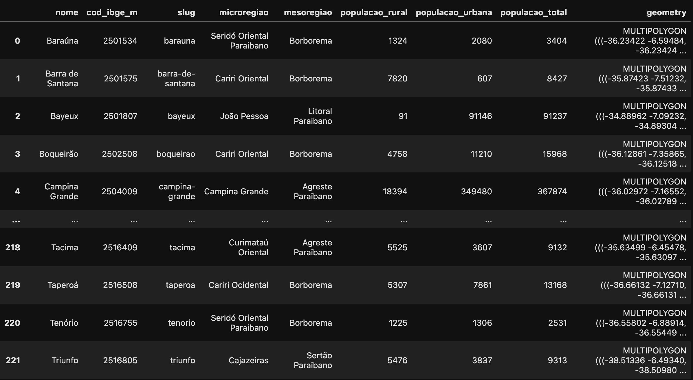
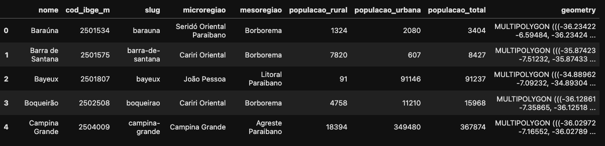
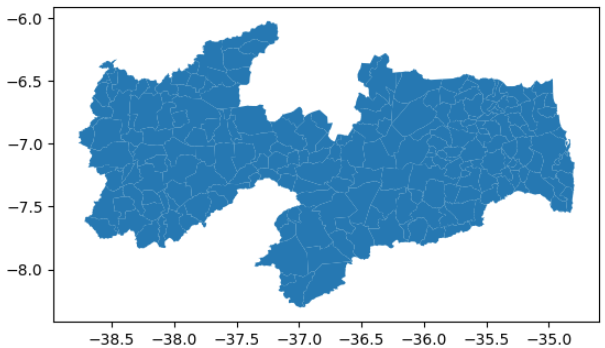
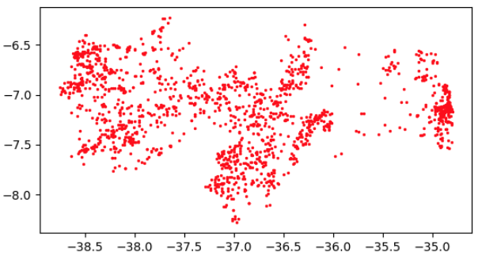
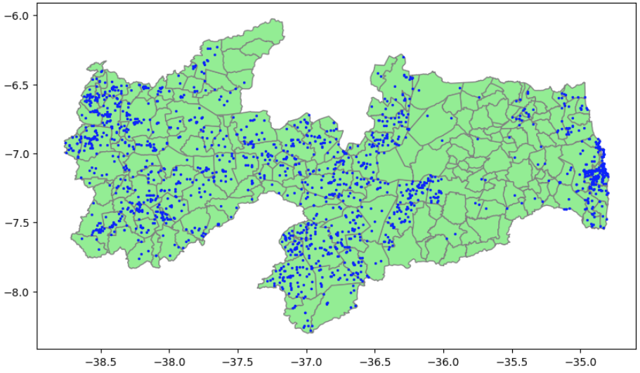

# 1. Introdução ao GeoPandas

O **GeoPandas** é um projeto *open source*, desenvolvido com a missão de simplificar e otimizar a manipulação e a análise de dados geoespaciais dentro do ecossistema Python. Ele atua como uma extensão poderosa do popular pacote **Pandas**, integrando as robustas estruturas de dados `DataFrame` e `Series` com a capacidade de lidar com geometrias.

## A Essência da Extensão

* A inovação central do GeoPandas é a introdução do `GeoDataFrame` e da `GeoSeries`.

* O `GeoDataFrame` é um Pandas DataFrame que possui uma coluna especial chamada `geometry`. Esta coluna armazena os dados espaciais (pontos, linhas, polígonos) e é a chave para realizar operações geoespaciais de forma vetorial e eficiente.

* A `GeoSeries` é uma Pandas Series especializada que contém os objetos geométricos e é capaz de realizar operações espaciais.

Essa integração permite que os usuários combinem a flexibilidade e o poder analítico do Pandas (como filtragem, agregação e junção de dados tabulares) diretamente com as capacidades de processamento espacial, como cálculo de áreas, determinação de vizinhança e operações de sobreposição (interseção, união, etc.).

## Dependências-Chave para Funcionalidade

Para entregar seu conjunto completo de funcionalidades, o GeoPandas depende de várias bibliotecas essenciais no stack geoespacial Python, garantindo a interoperabilidade e o desempenho:

* **Shapely**: É o motor geométrico. O Shapely fornece o suporte fundamental para a criação, manipulação e análise das geometrias (objetos como Point, LineString e Polygon), permitindo que o GeoPandas execute operações geométricas precisas.

* **Fiona**: Atua como a interface de leitura e escrita de dados. O Fiona permite que o GeoPandas acesse, leia e grave diversos formatos de arquivos geoespaciais vetoriais (como Shapefiles, GeoJSON, KML, entre outros), traduzindo-os eficientemente para as estruturas do Python.

* **Matplotlib**: A fundação para a visualização. Integrado nativamente, o Matplotlib permite a plotagem rápida e intuitiva de mapas e figuras geométricas, essencial para a exploração de dados e a comunicação dos resultados da análise.

Em resumo, o GeoPandas eleva a análise de dados geoespaciais em Python de uma tarefa complexa de múltiplos scripts para um fluxo de trabalho coeso, intuitivo e de alto desempenho, centralizando a manipulação tabular e espacial em uma única estrutura de dados.


## O GeoDataFrame em Detalhe

O GeoDataFrame é a estrutura de dados central do GeoPandas e representa a integração perfeita entre dados tabulares (descritivos) e dados espaciais (geométricos).

### O que é?

Na prática, um GeoDataFrame é um Pandas DataFrame que foi aprimorado. Ele se comporta como uma tabela de dados normal, permitindo todas as operações do Pandas (filtragem, ordenação, agregação, fusão de tabelas), mas com uma **coluna obrigatória e especial** chamada `geometry`.

### Coluna `geometry`

* Esta coluna armazena objetos espaciais (geometrias), como pontos, linhas ou polígonos. Estes objetos são, na verdade, instâncias da biblioteca Shapely.

* É essa coluna que permite que o GeoPandas execute as operações geoespaciais.

* Um GeoDataFrame também inclui informações sobre o Sistema de Coordenadas de Referência (CRS), que é essencial para garantir que os dados estejam localizados corretamente na Terra e que as operações espaciais sejam realizadas com precisão.


## 2. Importando Dados Espaciais para um GeoDataframe

O GeoPandas trabalha principalmente com dados vetoriais. A biblioteca é otimizada para manipular e analisar as geometrias de Ponto, Linha e Polígono armazenadas na coluna geometry do GeoDataFrame (e que são processadas pela Shapely).

No entanto, o GeoPandas pode ser usado em conjunto com outros pacotes Python, como o **Rasterio**, para lidar com dados raster, garantindo que o stack Python seja completo para qualquer necessidade geoespacial.

O código abaixo é um exemplo de como importar a biblioteca geopandas, onde usualmente trocamos seu nome por `gpd`, para agilizar a digitação. Em seguida, importamos o arquivo GeoJSON `municipios.geojson`

### Lendo um GeoJSON:


```python
import geopandas as gpd

# caminho até o arquivo geojson:
path = '/Users/marcellodebarrosfilho/code/ifpb/dados_geopandas/municipios.geojson'

municipios = gpd.read_file(path)

municipios
```



```python
# exibe os 5 primeiros registros
municipios.head()
```


```python
municipios.plot()
```




### Lendo um arquivo .CSV:

Para ler um csv, a melhor estratégia é carregar os dados em um DataFrame e em seguida convertê-lo em um GeoDataframe:

```python
import pandas as pd
import geopandas as gpd

path = '/Users/marcellodebarrosfilho/code/ifpb/dados_geopandas/pocos_pb.csv'

# 1. Carregamos como um DataFrame comum do Pandas
pocos_df = pd.read_csv(path)
pocos_df.head()

# 2. Convertemos para um GeoDataFrame
pocos = gpd.GeoDataFrame(
    pocos_df, # O DataFrame original com os dados
    # A geometria é criada a partir das colunas de longitude (x) e latitude (y)
    geometry = gpd.points_from_xy(pocos_df.longitude, pocos_df.latitude),
    # ESSENCIAL: Informamos o Sistema de Coordenadas (CRS) desses lat/lon
    crs = "EPSG:4326" # (WGS 84)
)

pocos.plot(markersize=2, color='red')
```




### Plotando as duas camadas em um único mapa:

```python
import matplotlib.pyplot as plt

# 1. Criamos a "tela em branco" (fig) e os "eixos" onde vamos desenhar (ax)
fig, ax = plt.subplots(figsize=(10, 8))

# 2. Plotamos os municípios, dizendo para ele usar os eixos 'ax'
municipios.plot(ax=ax, color='lightgreen', edgecolor='gray')

# 3. Plotamos os poços, dizendo para ele usar também 'ax'
pocos.plot(ax=ax, color='blue', markersize=2)

# 4. Mostramos o resultado final
plt.show()
```




### Explicando linha por linha:

```python
import matplotlib.pyplot as plt
```

* Importa o módulo `pyplot` da biblioteca **Matplotlib**, e dá a ele o apelido padrão `plt`.

* Esse módulo fornece funções simples para criar e manipular gráficos.


```python
fig, ax = plt.subplots(figsize=(10, 8))
```

Essa linha faz duas coisas principais:

1. Cria uma nova figura (fig)

	* Pense em fig como o **“papel em branco”** onde você desenhará o gráfico.

	* Ela pode conter um ou mais eixos (gráficos individuais).

2. Cria um ou mais eixos (`ax`)

	* O `ax` (de axes) é o **sistema de coordenadas onde o gráfico realmente é desenhado**.

	* É nele que você chama métodos como `.plot()`, `.scatter()`, ou, no caso do GeoPandas, passa com `ax=ax` para desenhar o mapa ali.

3. Define o tamanho da figura

	* O argumento `figsize=(10, 8)` define o tamanho da imagem em polegadas (largura=10, altura=8).

	* Isso afeta a proporção e a resolução visual do seu mapa.


### Explorando os GeoDataframes

O método `.info()` fornece um resumo do GeoDataFrame, incluindo o número de entradas, tipos de dados e consumo de memória.

```python
municipios.info()

<class 'geopandas.geodataframe.GeoDataFrame'>
RangeIndex: 223 entries, 0 to 222
Data columns (total 9 columns):
 #   Column            Non-Null Count  Dtype   
---  ------            --------------  -----   
 0   nome              223 non-null    object  
 1   cod_ibge_m        223 non-null    object  
 2   slug              223 non-null    object  
 3   microregiao       223 non-null    object  
 4   mesoregiao        223 non-null    object  
 5   populacao_rural   223 non-null    int64   
 6   populacao_urbana  223 non-null    int64   
 7   populacao_total   223 non-null    int64   
 8   geometry          223 non-null    geometry
dtypes: geometry(1), int64(3), object(5)
memory usage: 15.8+ KB
```

### Listando os nomes das colunas

```python
municipios.columns

Index(['nome', 'cod_ibge_m', 'slug', 'microregiao', 'mesoregiao',
       'populacao_rural', 'populacao_urbana', 'populacao_total', 'geometry'],
      dtype='object')
```

### Verificando o Sistema de Referência Espacial (CRS)

```python
municipios.crs

<Geographic 2D CRS: EPSG:4326>
Name: WGS 84
Axis Info [ellipsoidal]:
- Lat[north]: Geodetic latitude (degree)
- Lon[east]: Geodetic longitude (degree)
Area of Use:
- name: World.
- bounds: (-180.0, -90.0, 180.0, 90.0)
Datum: World Geodetic System 1984 ensemble
- Ellipsoid: WGS 84
- Prime Meridian: Greenwich

```
