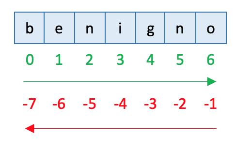

# Strings

Uma string em Python é objeto do tipo str.

```python
nome = 'João'
type(nome)
>>> <class 'str'>
```

### Métodos da Classe String:

```python
dir(nome)
>>> ['__add__', '__class__', '__contains__', '__delattr__', '__dir__',
'__doc__', '__eq__', '__format__', '__ge__', '__getattribute__',
'__getitem__', '__getnewargs__', '__gt__', '__hash__', '__init__',
'__iter__', '__le__', '__len__', '__lt__', '__mod__', '__mul__',
'__ne__', '__new__', '__reduce__', '__reduce_ex__', '__repr__',
'__rmod__', '__rmul__', '__setattr__', '__sizeof__', '__str__',
'__subclasshook__', 'capitalize', 'casefold', 'center', 'count',
'encode', 'endswith', 'expandtabs', 'find', 'format',
'format_map', 'index', 'isalnum', 'isalpha', 'isdecimal',
'isdigit', 'isidentifier', 'islower', 'isnumeric',
'isprintable', 'isspace', 'istitle', 'isupper', 'join',
'ljust', 'lower', 'lstrip', 'maketrans', 'partition',
'replace', 'rfind', 'rindex', 'rjust', 'rpartition',
'rsplit', 'rstrip', 'split', 'splitlines', 'startswith',
'strip', 'swapcase', 'title', 'translate', 'upper','zfill']
```

```python
help(nome.upper)

Help on built-in function upper:

upper(...) method of builtins.str instance
    S.upper() -> str

    Return a copy of S converted to uppercase.
    
nome.upper()    
>>> 'JOÃO'
```

### Concatenação de Strings:

```python
nome = 'Rodrigo'
sobrenome = 'Santos'
nome + sobrenome
>>> 'RodrigoSantos'
nome + ' ' + sobrenome
>>> 'Rodrigo Santos'
```

### Operador `in`:

```python
texto = 'hoje tem aula no IFPB'
'aula' in texto
>>> True
'Hoje' in texto
>>> False
'z' in texto
>>> False 
```

###  A função format()

```python
nome = 'José'
idade = 25

print('O meu nome é {} e a minha idade é {}'.format(nome, idade))
```

### f-trings:

💥  f-strings só estão disponíveis a partir do Python >= 3.6:

```python
nome = 'José'
idade = 25

print(f'O meu nome é {nome} e a minha idade é {idade}')
```

### Fatiamento de strings ou *Slicing*:



```python
palavra = 'benigno'
len(palavra)
>>> 7
palavra[0]
>>> 'b'
palavra[6]
>>> 'o''
palavra[0:3]
>>> 'ben'
# mesmo resultado da anterior:
palavra[:3]
>>> 'ben'
palavra[1:4]
>>> 'eni'
palavra[-1]
>>> 'o'
palavra[-3]
>>> 'g'
palavra[2:-2]
>>> 'nig'
```

### Exercícios:

1. Escreva os textos a seguir capitalizados, exceto as preposições 'da', 'de', 'di', 'do', 'du', 'para'.

```
'joaquim josé da silva xavier'
'pedro de souza é filho do joão da silva'
'fui para joão pessoa passear de barco'
```

2. Faça um programa que troque o texto 1 pelo texto 2, conforme segue:

```
texto 1: 'Regis da Silva Santos'

texto 2: 'R3g15 d4 S1lv4 S4nt05'
```
1. Faça um programa que leia 2 strings e informe o conteúdo delas seguido do seu comprimento. Informe também se as duas strings possuem o mesmo comprimento e são iguais ou diferentes no conteúdo. A saída do programa deve ser semelhante a saída abaixo:
```
Compara duas strings
String 1: Brasil Hexa 2006
String 2: Brasil! Hexa 2006!
Tamanho de "Brasil Hexa 2006": 16 caracteres
Tamanho de "Brasil! Hexa 2006!": 18 caracteres
As duas strings são de tamanhos diferentes.
As duas strings possuem conteúdo diferente.
```